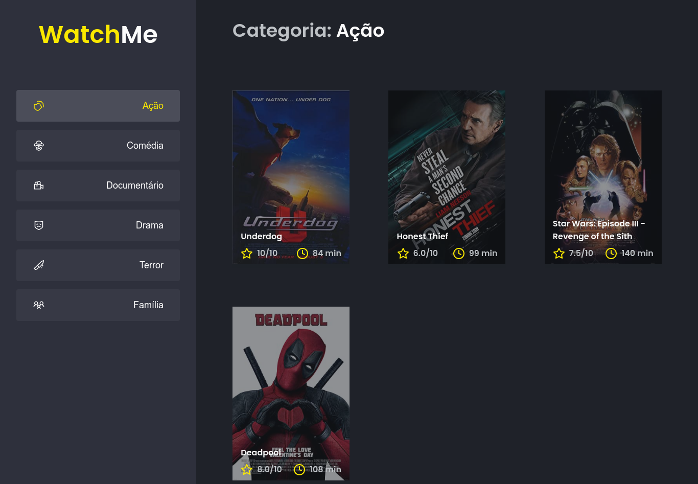

<h1 align="center">WatchMe</h1>

<p align="center">
	

  

  
</p>

<p align="center">
	
</p>

## 💻 Sobre o desafio

Nesse desafio, você deverá criar uma aplicação para treinar o que aprendeu até agora no ReactJS

Essa será uma aplicação onde o seu principal objetivo é refatorar uma página para listagem de filmes de acordo com gênero. 

A aplicação já está totalmente funcional mas grande parte do seu código está diretamente no arquivo `App.tsx`. Para resolver isso da melhor forma, é necessário dividir a aplicação em **pelo menos** duas partes principais: sidebar e o conteúdo principal que possui o header e a listagem de filmes.

- A aplicação possui apenas uma funcionalidade principal que é a listagem de filmes;
- Na sidebar é possível selecionar qual categoria de filmes deve ser listada;
- A primeira categoria da lista (que é "Ação") já deve começar como marcada;
- O header da aplicação possui apenas o nome da categoria selecionada que deve mudar dinamicamente.

## 🧪 Tecnologias

Esse projeto foi desenvolvido com as seguintes tecnologias:

#### **Website**  ([ReactJS](https://reactjs.org/) +  [TypeScript](https://www.typescriptlang.org/) )
<br>

## 🚀 Como executar

### Pré-requisitos

Antes de começar, você vai precisar ter instalado em sua máquina as seguintes ferramentas:
[Git](https://git-scm.com), [Node.js](https://nodejs.org/en/).

#### 🧭 Rodando a aplicação

```bash

# Clone este repositório
$ git@github.com:araujo-jp/WatchMe.git

# Acesse a pasta do projeto no seu terminal/cmd
$ cd WatchMe

# Instale as dependências (escolha um)
$ npm install
$ yarn install

# Execute a aplicação em modo de desenvolvimento (escolha um)
$ npm run dev
$ yarn dev

# A aplicação será aberta na porta:8080
# acesse http://localhost:8080
```
## 📝 Licença

Esse projeto está sob a licença MIT. Veja o arquivo [LICENSE](./LICENSE) para mais detalhes.

---

<p align="center">Feito com :heart: by João Paulo Araújo 👋🏻</p>

---